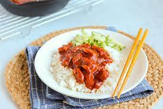

<!-- Headings -->
# De Verrukkulluk website

Dit is de website gemaakt door mij voor het project Verrukkulluk.

## Structuur 

De site bestaat uit het main frame dat gekoppeld kan worden aan 4 verschillende pagina's, te weten:

* De Homepage.
* De Detailpagina.
* De Boodschappenlijst.
* De Gebruikerspagina.

___
___

## Main Frame

Aan het main frame zijn alle pagina's verbonden. Bovenaan het frame kunt U het Logo en de Carousel zien, met de Carousel scrollend door alle recepten. Ook is er rechtsboven een zoekfunctie, die zoekt op trefwoorden (substrings) aanwezig in de informatie over een bepaald recept. Een druk op enter laat alle recepten zien die de opgegeven substring hebben.

De Agenda en de Login zijn gesitueerd aan de linkerzijde. Hierin kan men inloggen als de gebruiker in de database kan worden gevonden. Anders wordt er een nieuwe gebruiker gecreëerd en dan toegevoegd aan de database, mits de email of gebruikersnaam al niet bestaat. Hierna wordt de gebruiker doorgestuurd naar de Gebruikerspagina.

Onderaan vindt men de contactinformatie van de site.

___

## Homepage

De homepage ziet er als volgt uit:


Op de homepage zijn alle recepten te zien samen met wat informatie, bestaande uit:

* Een foto van het recept.
* Het aantal personen.
* Het aantal Calorieën .
* De prijs van het recept.
* De titel van het recept.
* De gemiddelde waardering.
* Een korte omschrijving.

Ook is er onderaan een knop die de gebruiker doorstuurt naar de Detailpagina van het desbetreffende recept.

___

## Detailpagina

Op de Detailpagina staan naast de informatie op de homepage nog meer details over het recept, waaronder

* Het Type Keuken waarin het recept is gemaakt.
* Het Type Voedsel wat het recept representeert.
* Een mogelijkheid voor de gebruiker het recept toe te voegen aan zijn of haar favorietenlijstje.
* Een knop Op Lijst.
* Een tab met:
    * Ingrediënten nodig voor het maken van het recept.
    * De Bereidingswijze voor het recept.
    * Opmerkingen van gebruikers.

Wanneer de gebruiker het recept toevoegt aan zijn favorietenlijstje, wordt de gebruiker direct toegevoegd aan de database. Tegelijkertijd wordt het hartje gevuld. De gebruiker kan dit ongedaan maken door nog een keer op het nu volle hart te klikken.

Klikt men op de knop Op Lijst, dan wordt men doorgestuurd naar de Boodschappenlijst.

### _Ingrediënten_

In de tab Ingrediënten staan alle ingrediënten die horen bij het desbetreffende recept. Elke Ingrediëntregel bestaat uit:

* Een foto van het ingrediënt.
* De titel van het ingrediënt.
* Een korte beschrijving van het ingrediënt.
* De hoeveelheid die aangeeft hoeveel er nodig is van dit ingrediënt om het recept te maken.

### _Bereidingswijze_

In de tab Bereidingswijze staat het stappenplan voor het maken van het recept.

### _Opmerkingen_

In de tab Opmerkingen vindt men beoordelingen van bepaalde gebruikers over het recept.

___

## Boodschappenlijst

Op de boodschappenlijst staan alle ingrediënten van die recepten waarvan de gebruiker op de knop Op Lijst heeft geklikt op de Detailpagina. Tevens worden deze ingrediënten dan toegevoegd aan de database. Naast de ingrediëntinformatie staat op de lijst:

* Het aantal eenheden nodig van hetzelfde ingrediënt
* De totale prijs van alle eenheden van het betreffende ingrediënt.
* De optie om het ingrediënt van het lijstje te gooien.

Tevens staat onderaan de totale prijs van alle ingrediënten.


<!-- Italics -->
_This text is italic_

<!-- Bold -->
**_This text is italic bold_**

<!-- Striketrough -->
~~This text~~ is strikethrough

<!-- Horizontal Rule -->
---
___

<!--Blockquote -->
> This is a quote

<!-- Links -->
[w3schools](http://w3schools.com)

<!-- UL -->
* Item 1
* Item 2
* Item 3
    * Nested Item 1

<!-- OL -->
1. Item 1
2. Item 2
1. Item 3

<!-- Inline Code Block -->
`<p>This is a paragraph</p>`

<!-- Images -->


<!-- Github Markdown -->

<!-- Code Blocks -->
```
    code instructions here
```
```php
    $bool = true;
    function check($bool){
        if($bool){
            echo "It is true!"
        }
    }
```

<!-- Tables -->
| Name | Email |
| ----- | ----- |
| Desse Johmen | dj@heerlijk.com|
| Som Tassen | st@heerlijk.com

<!-- Task Lists -->
* [x] Task1